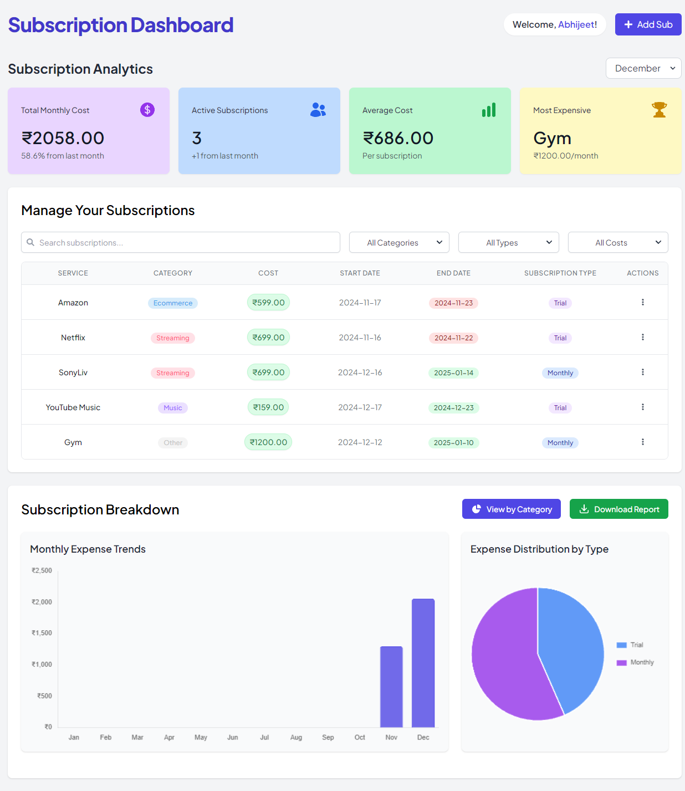
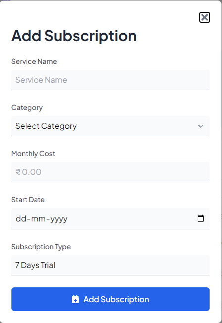

#  SubTracker

SubTracker is a modern web application designed to simplify subscription management. With a sleek interface, it allows users to track subscriptions, gain insights through analytics, and seamlessly integrate with Google Calendar for reminder.

---

## ✨ Key Features

### 📊 Smart Subscription Tracking
- **Unified Dashboard**: View all subscriptions in one place.
- **Automatic Categorization**: Organize subscriptions by type.
- **Trial & Short-Term Plan Tracking**: Never miss a renewal date.

### 📈 Insightful Analytics
- **Spending Breakdown**: Track monthly and yearly expenses.
- **Category-Wise Analysis**: Understand where your money goes.
- **Visual Reports**: Get charts and graphs to make data easy to digest.

### 🔔 Smart Notifications
- **Google Calendar Integration**: Sync subscriptions with your calendar.
- **Email Reminders**: Receive alerts for upcoming renewals.

### 📱 Responsive Design (Coming Soon)
- **Optimized for All Devices**: Seamless experience across desktops, tablets, and mobile.

---

## 🛠️ Tech Stack

### Frontend
- **Next.js** (v14)
- **React** (v18)
- **TypeScript**
- **Tailwind CSS**
- **Framer Motion**

### Backend
- **PostgreSQL**
- **Prisma ORM**
- **Clerk Authentication**
- **Vercel Analytics**

### Development & Deployment
- **Docker**
- **Vercel**

---

## 📸 Screenshots



 


## 🚀 Getting Started

### Prerequisites
- **Node.js** (v20 or higher)
- **npm** or **yarn**
- **Docker** (optional)


### Installation

1. **Clone the repository**

   ```bash
      git clone https://github.com/yourusername/subtracker.git
   ```

2. **Install dependencies**

   ```bash
      npm install
   ```

3. **Set up environment variables**
   - Create a `.env` or `.env.local` file in the root directory
   - Add necessary environment variables

4. **Start development server**

   ```bash
      npm run dev
   ```

## 🐳 Docker Setup

1. **Using Pre-built Image**
```bash
# Pull the image from Docker Hub
docker pull abhijet12/subtracker-app:latest
```

```bash
# Run the container
docker run -d -p 3000:3000 \
  -e DATABASE_URL="your-database-url" \
  -e CLERK_SECRET_KEY="your-clerk-secret" \
  -e NEXT_PUBLIC_CLERK_PUBLISHABLE_KEY="your-clerk-key" \
  -e NEXT_PUBLIC_CLERK_FRONTEND_API="your-frontend-api" \
  abhijet12/subtracker-app:latest
```

2. **Using Docker Compose**
```bash
# Start the application
docker-compose up -d

# View logs
docker-compose logs -f

# Stop the application
docker-compose down
```

### Development with Docker

1. **Build and Start**
```bash
# Build and start containers
docker-compose up --build

# Start in background
docker-compose up -d
```

2. **Rebuild After Changes**
```bash
# Rebuild with new changes
docker-compose up --build
```

3. **Clean Up**
```bash
# Stop and remove containers
docker-compose down

# Clean up unused resources
docker system prune
```

### Environment Variables
Create a `.env` file with the following variables:
```env
DATABASE_URL=your-database-url
CLERK_SECRET_KEY=your-clerk-secret
NEXT_PUBLIC_CLERK_PUBLISHABLE_KEY=your-clerk-key
NEXT_PUBLIC_CLERK_FRONTEND_API=your-frontend-api
```

### Available Docker Tags
- `latest`: Most recent stable build
- `prod`: Production-ready version

## 📦 Database Management
### Initialize Prisma

```bash
npm run prisma:migrate
```
### Push schema changes

```bash
npm run prisma:db-push
```


## 🚀 Deployment

The application is optimized for deployment on the [Vercel Platform](https://vercel.com).
For detailed deployment instructions, visit the [Next.js deployment documentation](https://nextjs.org/docs/deployment).


## 📝 License

This project is licensed under the MIT License - see the LICENSE file for details.

## 📧 Contact

For questions about the Terms of Service or Privacy Policy:
- Email: abhijeetsharma476@gmail.com
